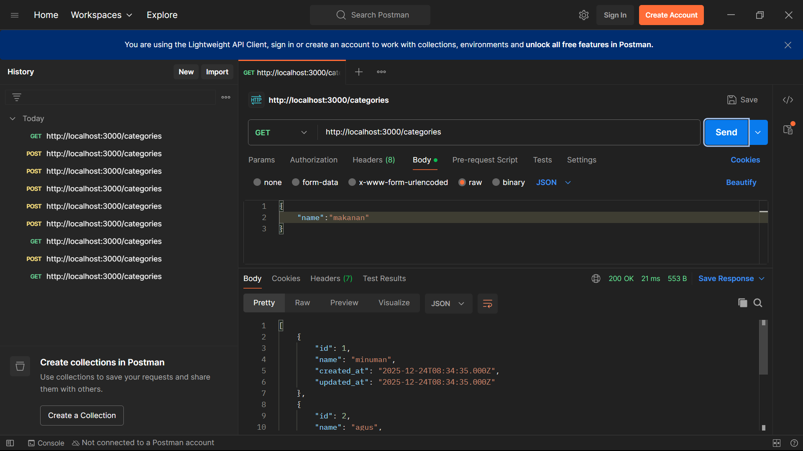
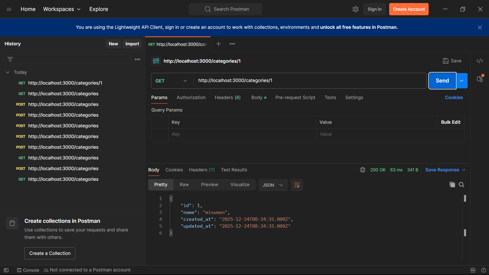
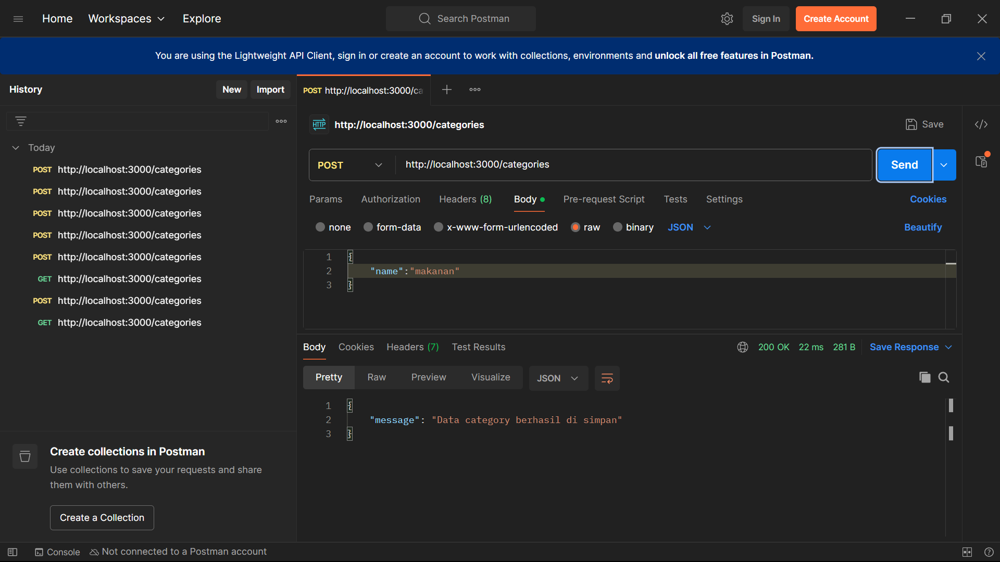

# Backend REST API – User, Category, Product

Project ini merupakan backend REST API sederhana menggunakan Node.js, Express, dan MySQL.

---

## A. Instalasi MySQL dan Tools

- XAMPP 
- MySQL Server
- phpMyAdmin

---

## B. Instalasi Project
### 1. Clone Repository
```bash
git clone <https://github.com/Adeanang/nodejs-crud-restapi.git> 
```
### 2. Masuk ke Folder Project
```bash 
cd nama-project
```
### 3. Inisialisasi Project
```bash 
npm init -y
```
## C. Instalasi ExpressJS
```bash 
npm install express
```
## D. Pembuatan Database yang berisi
1. Tabel Users
2. Tabel Categories
3. Tabel Products
## E. Instalasi MySQL Driver
```bash 
npm install mysql
```
## F. Environment Variable (.env)
### 1. Instal dotenv
```bash 
npm install dotenv
```
### 2. Buat File .env
```bash 
PORT=3000
DB_HOST=localhost
DB_USER=root
DB_PASSWORD=
DB_NAME=users
```
## G. Menjalankan Server
### 1. Instal Nodemon
```bash 
npm install -D nodemon
```
### 2. Edit Script package.json
"scripts": {
    "dev": "nodemon server.js"
    }
### 3. Jalankan Server
```bash 
npm run dev 
```

### I. Pengujian API Menggunakan Postman
Pastikan server sudah berjalan: http://localhost:3000

##  CATEGORY API

<h2>CATEGORY</h2>
1. Menampilkan semua data

2. menampilkan data berdasarkan ID

3. mengupdate data

4. menambahkan data

5. menghapus data


##  PRODUCT API

<h2>PRODUCTS</h2>
1. Menampilkan semua data

2. menampilkan data berdasarkan ID

3. mengupdate data

4. menambahkan data

5. menghapus data

